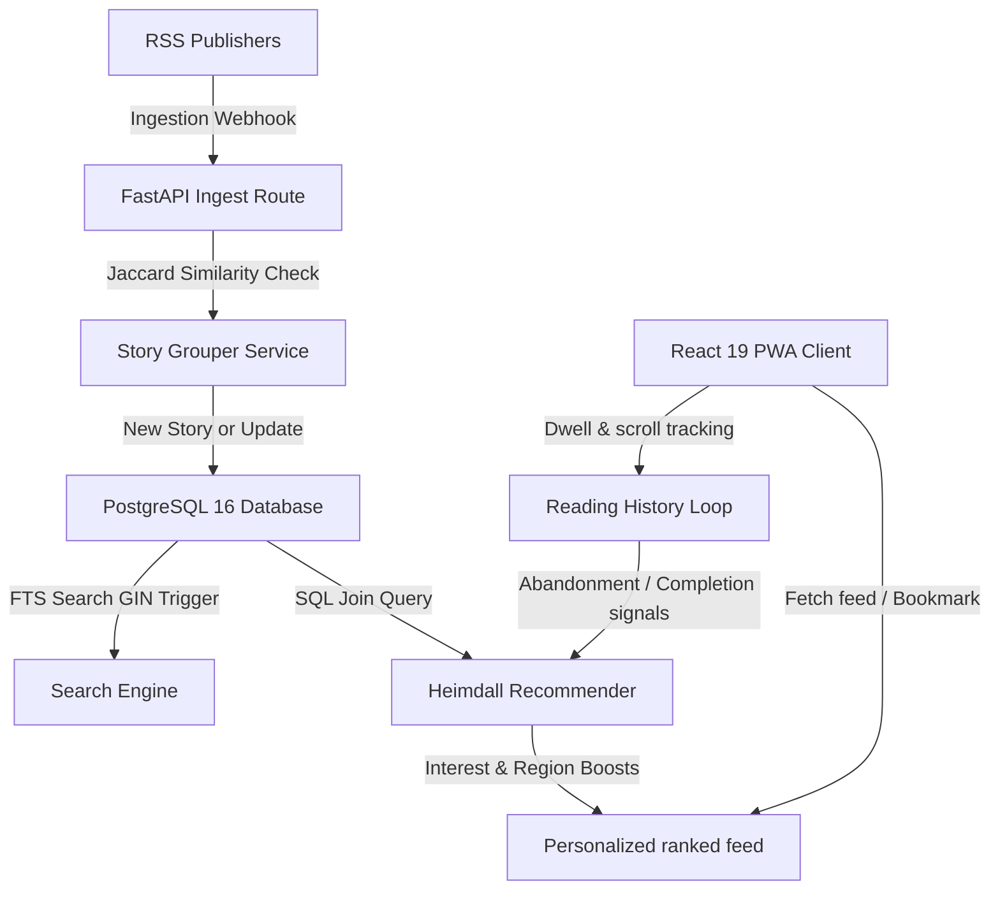

# Heimdall — System Architecture

This document details the software system architecture of **Heimdall** (Consumer Edition). Heimdall is designed for high efficiency on free-tier cloud resources by moving all calculations from expensive vector databases and container models to optimized SQL relational queries.

---

## High-Level System Map

---

## 1. Content Processing Layer

### Ingestion & Deduplication
- **Pipeline:** Articles are ingested from active RSS feeds via the `/api/v1/internal/ingest` webhook.
- **Deduplication:** A SHA-256 hash of the cleaned body text is computed. Duplicate content is discarded at the database insert constraint.

### Story Clustering (Jaccard Overlap)
Instead of semantic embedding searches, Heimdall clusters related articles using a deterministic Jaccard token-overlap check over headline tokens:
$$\text{Jaccard}(A, B) = \frac{|T_A \cap T_B|}{|T_A \cup T_B|}$$
If two headlines in a 12-hour window have a Jaccard score $\ge 0.40$ (or share $\ge 2$ entities/keywords) and match category tags, they are grouped into the same story cluster.
If the matched article belongs to the same publisher, it updates the story details but does not increment `publisher_diversity` (preventing duplicate publisher score inflation).

---

## 2. Relational & Search Layer

### PostgreSQL Schema
Heimdall operates with a minimal relational database layout:
- `users`: Core account profiles and onboarding parameters.
- `publishers`: Credibility records and feed addresses.
- `articles`: Canonical URL records, headlines, body chunks, and predicted categories.
- `stories`: Cluster details, titles, summaries, importance scores, and verification ratings.
- `bookmarks`: Saved stories junction table.
- `reading_history`: Scroll depth metrics, interaction logging, and dwell timers.

### Full-Text Search (FTS)
- In production, PostgreSQL’s FTS engine performs full-text query matching.
- A GIN index is built on a dedicated `search_vector` column.
- Database triggers (`tsvector_update_trigger`) synchronize the vector data during insertions.
- In offline development/testing, the search fallback executes SQL `LIKE` parameter matches to enable database-independent execution on SQLite.

---

## 3. Feed Recommendation & Feedback Engine

### SQL Ranking Formula
Candidates are sorted dynamically using pure SQL query calculations. The composite ranking score is defined as:
$$\text{Score} = W_s \cdot \text{InterestMatch} + W_i \cdot \text{Importance} + W_t \cdot \text{Trending} + W_r \cdot \text{RegionMatch}$$
- **Freshness Decay:** Multiplied by an exponential freshness decay:
  $$\text{Decay}(t) = 2^{-\frac{t}{t_{\text{half}}}}$$
- **Region Boost:** Matches story locations against the user's home state/city profile.

### Reading Completion Feedback Loop
User interactions are logged to the `reading_history` table. When compiling feed suggestions:
- Categories with average reading progress $\ge 70\%$ receive a $+0.10$ interest match boost.
- Categories with average reading progress $\le 20\%$ receive a $-0.10$ abandonment penalty.
- Users with $< 3$ total read records bypass personalization to resolve cold start.
