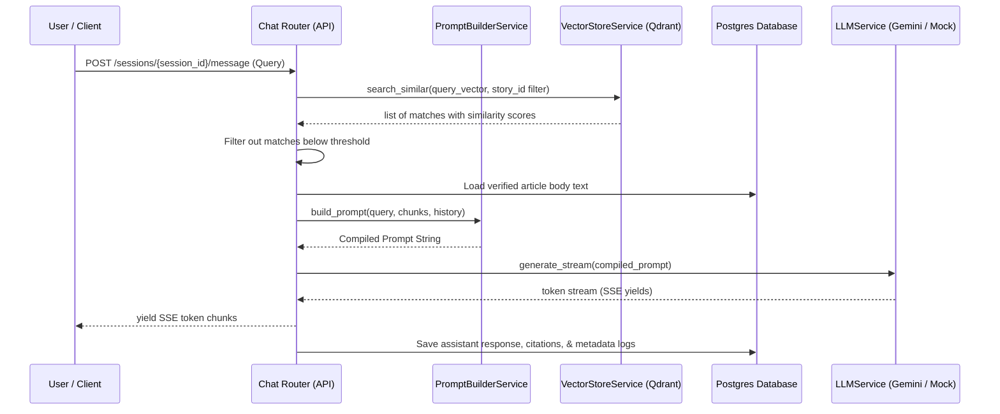

# Conversational AI & Retrieval-Augmented Generation (RAG) Engine

This document details the architecture, service abstractions, prompting lifecycle, and telemetry configuration for the Adaptive NewsSphere Conversational Q&A system.

---

## 1. Context-Bound Q&A Pipeline Flow

The engine implements a fully isolated, story-bound RAG pipeline. Users query the system contextually within a story cluster, restricting the generator to facts contained only in the matching story articles.



---

## 2. Abstraction Interface

To keep the pipeline vendor-agnostic and future-proof for local LLMs (e.g., Ollama), all generation flows utilize the `BaseLLMProvider` contract:

```python
class BaseLLMProvider(ABC):
    @abstractmethod
    async def generate(self, prompt: str) -> str:
        """Generates a complete text response synchronously."""
        pass

    @abstractmethod
    def generate_stream(self, prompt: str) -> AsyncIterator[str]:
        """Streams response tokens asynchronously."""
        pass
```

Providers implemented:
1.  **`GeminiProvider`**: Interfaces with `google-generativeai` package to hit Gemini flash models.
2.  **`MockProvider`**: Used for unit testing and offline runs, simulating citations based on the incoming prompt headers.

---

## 3. PromptBuilderService & Prompt Lifecycle

The `PromptBuilderService` (`app/services/prompt_builder.py`) holds exclusive responsibility for formatting prompts, avoiding bleed of system instructions into orchestration services.

### Prompt Assembly Layout
```
[System Instructions]
- Grounding constraint (no hallucination)
- Citation formatting directive: [Source: Publisher Name]
- No-context fallback response message

[RAG Context]
--- Source [1]: BBC News ---
Title: article title
Published Date: ISO Timestamp
Content: overlapping text window content...

--- Source [2]: TechCrunch ---
Title: article title
...

[Conversation History]
User: message text
Assistant: message text

[User Query]
USER QUERY: user message text
```

---

## 4. Grounded Confidence & Citations

### Confidence Score Calculation
The engine calculates answer confidence deterministically considering average similarity, retrieved count coverage, character limits, and citation counts:

$$C = 0.50 \cdot \text{Similarity} + 0.20 \cdot \min(1.0, \frac{N_{\text{articles}}}{3}) + 0.10 \cdot \min(1.0, \frac{C_{\text{chars}}}{6000}) + 0.20 \cdot \min(1.0, \frac{N_{\text{citations}}}{2})$$

### Citations Resolution
Assistant text containing `[Source: Publisher Name]` format is parsed via regular expressions. The matched publisher name is mapped back to the loaded context chunks, storing the matching article ID, publisher details, source similarity, and citation confidence.

---

## 5. Telemetry & Metrics Schema

Every message log stores detailed performance metadata within the `chat_metadata` JSON column:

| Attribute | Type | Description |
| :--- | :--- | :--- |
| `conversation_engine_version` | `str` | Active version of the engine ("v1"). |
| `retrieval_trace` | `dict` | Includes `top_k`, `threshold`, `retrieved_before_filter`, `retrieved_after_filter`, `passed_threshold`. |
| `streaming_metrics` | `dict` | Includes `first_token_latency_ms`, `stream_duration_ms`, `estimated_output_tokens`. |
| `prompt_size_chars` | `int` | Length of the compiled prompt string. |
| `response_size_chars` | `int` | Length of the generated response string. |
