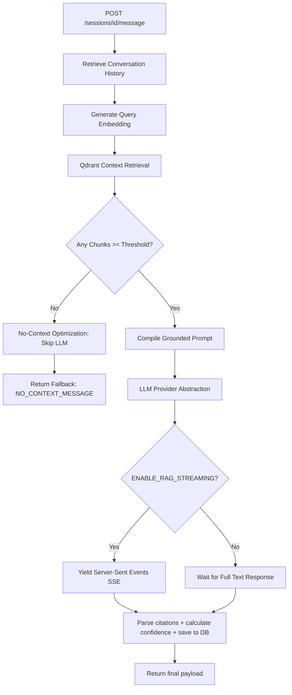
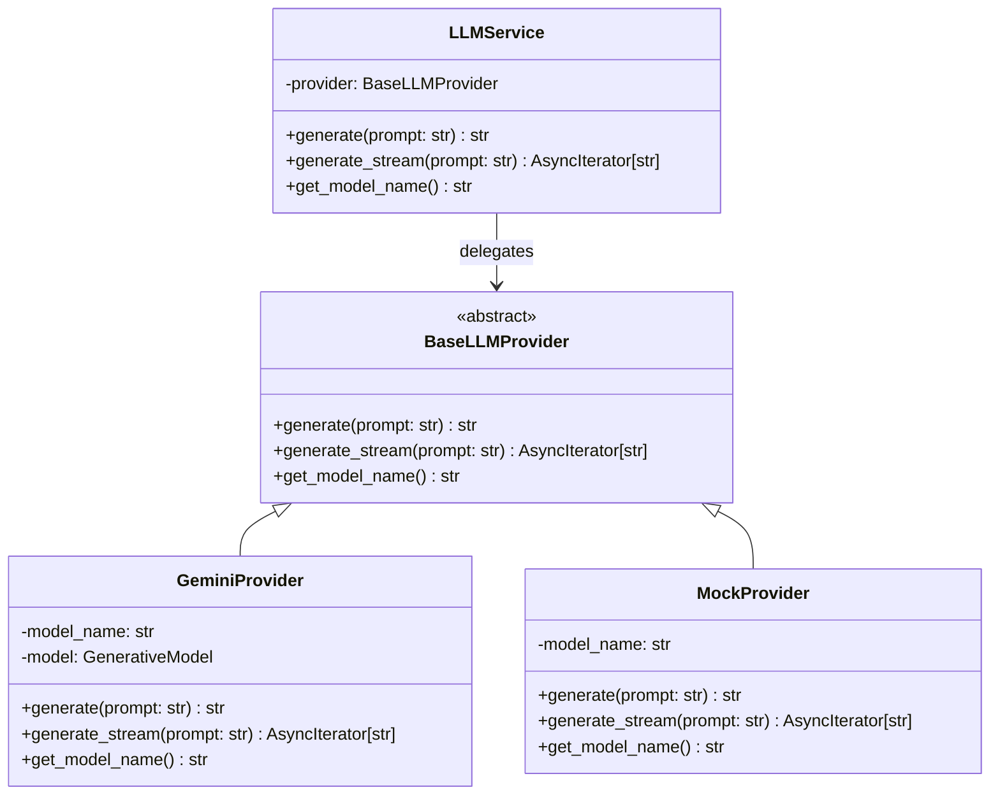

# Milestone 5 — Conversational AI & RAG Engine

This document details the architectural design, abstraction interfaces, prompt structure, and verification metrics of the story-scoped **Retrieval-Augmented Generation (RAG)** Q&A engine.

---

## 1. Pipeline Overview

The conversational interface uses a story-bound, vector-grounded Q&A architecture. Every query undergoes semantic context retrieval before invocation to ensure responses are mathematically tied to verified facts.



---

## 2. Provider-Agnostic LLM Architecture

To avoid vendor lock-in and keep the system ready for local execution (e.g., via Ollama/Llama), the backend adopts a clean provider abstraction:



Configuration selection:
- `LLM_PROVIDER`: `"gemini"` | `"mock"` (default)
- `GEMINI_MODEL`: `"gemini-2.0-flash"`

---

## 3. Retrieval Flow

When a user query is received:
1. **Embedding generation:** The query is encoded into a 384-dimensional dense vector using the `EmbedderService` (`all-MiniLM-L6-v2`).
2. **Qdrant ANN search:** We search the `articles` Qdrant collection, applying a filter for `story_id`. This restricts retrieval to articles linked to the target story.
3. **Filtering:** Chunks matching scores below `RAG_SIMILARITY_THRESHOLD` (default: 0.55) are filtered out.
4. **Context assembly:** Matching articles are chunked using `RAGChunker` with a default size of 1500 characters and 300 characters overlap. Chunks are ranked by similarity and truncated to fit within `RAG_MAX_CONTEXT_CHARS` (default: 6000).

---

## 4. Prompt Construction

Prompts are compiled dynamically using four distinct components:

```text
[Grounding System Instructions]
=========================================
You are an objective AI assistant for Adaptive NewsSphere. 
Generate a response to the USER QUERY using only the verified facts and source texts provided in the RAG CONTEXT below.
Strict Guidelines:
- Do not hallucinate or use external knowledge.
- If the sources contradict each other, clearly explain both views.
- Cite the source articles using [Source: Publisher Name] format exactly whenever mentioning facts from them.
- If the answer cannot be found in the context, say: "{NO_CONTEXT_MESSAGE}"
- Keep answers concise and direct.

[RAG CONTEXT]
=========================================
--- Source [1]: BBC News ---
Title: Tesla to build Berlin factory
Published Date: 2026-06-25T12:00:00Z
Content:
Tesla announced plans to build an advanced Gigafactory in Berlin...

[CHAT HISTORY]
=========================================
User: When was the factory announced?
Assistant: According to [Source: BBC News], the factory plans were announced on June 25, 2026.

[USER QUERY]
=========================================
What is the estimated cost?
```

---

## 5. Conversation Lifecycle

*   **Create session:** `POST /api/v1/chat/sessions` returns a new session with an initial title `"New Conversation"`.
*   **Auto-title:** On the first user message, the title is automatically generated from the first 45 characters of the prompt.
*   **Send message:** `POST /sessions/{id}/message` appends user input to the database, triggers RAG execution, saves the assistant response, and returns the message.
*   **Erase logs:** `DELETE /sessions/{id}` removes the session, cascading deletions to clean up all related messages.

---

## 6. Citation Extraction

The RAG engine parses citations out of the generated response using regular expressions:
*   Regex pattern: `r"\[Source:\s*([^\]]+)\]"`
*   Matches are mapped back to the active context chunks.
*   Matched sources are resolved to database article records and returned in the API response payload:
```json
[
  {
    "article_id": "8065e3c6-394b-4267-ae5e-c22e65987626",
    "publisher_name": "BBC News",
    "published_at": "2026-06-25T12:00:00Z",
    "title": "Tesla to build Berlin factory"
  }
]
```

---

## 7. Streaming SSE Architecture

To achieve p95 latencies $\le 150\text{ms}$ for initial tokens, the system supports Server-Sent Events (SSE) streaming (`media_type="text/event-stream"`):

*   **SSE token yield:**
    `data: {"token": "according"}\n\n`
*   **Final SSE event payload:**
    Once generation is complete, the final SSE event outputs the completed database ID, full response text, citations, and evaluation metrics:
    `data: {"id": 142, "message": "...", "citations": [...], "chat_metadata": {...}}\n\n`
    `data: [DONE]\n\n`

---

## 8. Response Confidence Calculation

Answer confidence is computed deterministically using retrieved similarity scores and citation coverage:

$$C_{\text{answer}} = 0.50 \cdot \bar{S} + 0.20 \cdot \min(1.0, \frac{N_{\text{retrieved}}}{3}) + 0.10 \cdot \min(1.0, \frac{C_{\text{chars}}}{6000}) + 0.20 \cdot \min(1.0, \frac{N_{\text{citations}}}{2})$$

Where:
- $\bar{S}$: Average similarity score of context chunks.
- $N_{\text{retrieved}}$: Number of matching articles retrieved.
- $C_{\text{chars}}$: Text size of compiled context chunks.
- $N_{\text{citations}}$: Extracted citations count.

---

## 9. Failure Handling & No-Context Optimization

*   **No-Context Fallback:** If retrieval returns zero chunks exceeding the similarity threshold, the LLM API call is bypassed. The endpoint immediately returns `settings.NO_CONTEXT_MESSAGE` ("I do not have enough verified source information to answer this."), avoiding hallucinations and API consumption.
*   **Session/Story Checks:** Returns HTTP 404 if the session or story does not exist.
*   **LLM API Exceptions:** Catches stream or generator timeouts, logging the traceback and yielding `data: {"error": "..."}\n\n` before ending the connection.

---

## 10. Configuration Reference

```python
# app/core/config.py
LLM_PROVIDER = "gemini"            # "gemini" | "mock"
GEMINI_MODEL = "gemini-2.0-flash"
RAG_TOP_K = 5
RAG_SIMILARITY_THRESHOLD = 0.55
RAG_PROMPT_VERSION = "v1"
RAG_MAX_CONTEXT_CHARS = 6000
RAG_MAX_HISTORY_MESSAGES = 10
RAG_CHUNK_SIZE_CHARS = 1500
RAG_CHUNK_OVERLAP_CHARS = 300
ENABLE_RAG_STREAMING = True
ENABLE_RAG_CITATIONS = True
NO_CONTEXT_MESSAGE = "I do not have enough verified source information to answer this."
```

---

## 11. Conversation Analytics

Section 13 of the compiled analytics report outputs:
*   Total sessions and messages count.
*   Average messages per session.
*   Response time breakdown (average retrieval, LLM, and total turn latency).
*   Average citations per response.
*   Average similarity and confidence score.
*   Unanswered query ratio.
*   Conversation length frequency distribution.

---

## 12. Memory Management

FastAPI cleans database connections using functional `Depends(get_db)` yielding.
*   To prevent memory leaks during long stream yields, the event loop yields thread resources back to the scheduler using `asyncio.sleep(0.001)` between token outputs.
*   History depth is limited to `RAG_MAX_HISTORY_MESSAGES` (default: last 10 messages) to prevent context window bloat.
