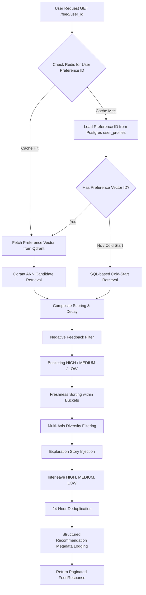

# Milestone 4 — Recommendation Engine Architecture

This document details the architectural design and mathematical formulation of the fully deterministic, local-first **Recommendation Engine** implemented in Milestone 4.

---

## 1. Pipeline Overview

The feed generation pipeline is a multi-stage deterministic pipeline designed to retrieve, rank, filter, and structure news stories tailored to each user.



---

## 2. Preference Engine

The user preference embedding is a running semantic profile representing the topics the user is interested in. Qdrant is the single source of truth for raw vector embeddings, while Redis acts as a hot cache for point lookup IDs.

### Exponential Moving Average (EMA) Math
When a user interacts with a story (e.g., click, bookmark, share, dwell), their preference vector is updated using an Exponential Moving Average against the interacted story's centroid embedding:

$$\vec{P}_{new} = (1 - \alpha) \cdot \vec{P}_{old} + \alpha \cdot \vec{C}_{story}$$

For negative interactions (e.g., *not interested*, *hide story*), the preference vector is pushed away from the story centroid:

$$\vec{P}_{new} = (1 + \alpha) \cdot \vec{P}_{old} - \alpha \cdot \vec{C}_{story}$$

### L2-Normalization
To maintain unit length for accurate cosine similarity queries, the vector is normalized after each update:

$$\vec{P}_{final} = \frac{\vec{P}_{new}}{\|\vec{P}_{new}\|_2}$$

---

## 3. Cold-Start Strategy

A user is considered in the **cold-start stage** if their running interaction count is below `COLD_START_THRESHOLD` (default: 5). 

During cold-start:
- Retrieval bypasses the Qdrant vector database.
- Candidate stories are fetched from PostgreSQL using the following deterministic query:

```sql
SELECT * FROM stories 
WHERE status = 'ACTIVE' 
ORDER BY (importance_score * trending_score) DESC 
LIMIT 60;
```

- This ensures new users are bootstrapped with stories that have high global popularity and verification credibility.

---

## 4. Warm User Strategy

A user becomes **warm** when their interaction count is at or above the threshold.

During warm-user serving:
- The preference vector is fetched from the Qdrant `user_preferences` collection by the user's UUID.
- An Approximate Nearest Neighbor (ANN) search is performed against the `stories` centroid collection using cosine distance with a score threshold (default: 0.30) to retrieve up to 60 candidates.

---

## 5. Ranking Formula

The ranking score combines semantic relevance with global quality indicators.

### Composite Score
The initial composite score is computed using configurable weights:

$$\text{score} = W_s \cdot \text{sem\_sim} + W_i \cdot \text{importance} + W_t \cdot \text{trending} + W_c \cdot \text{credibility}$$

Where:
- $\text{sem\_sim}$: Cosine similarity between user preference and story centroid (1.0 for cold-start).
- $\text{importance}$: The story's pre-computed global importance score.
- $\text{trending}$: Recency-based growth rate.
- $\text{credibility}$: Mean publisher credibility score within the story cluster.

### Final Score
The final ranking score applies a freshness decay factor based on the story's age:

$$\text{final\_score} = \text{score} \times \text{freshness\_decay}(t)$$

### Recommendation Confidence
Every recommendation exposes a confidence score alongside its composite score, computed using the following formula:

$$C = \text{base\_confidence} + C_{\text{interactions}} + C_{\text{maturity}} + C_{\text{stability}}$$

Where:
- $\text{base\_confidence}$: $0.40$ for cold-start mode, $0.70$ for warm users.
- $C_{\text{interactions}}$: Modifier for profile maturity based on interaction count, calculated as $\min(0.20, \text{interaction\_count} \times 0.01)$.
- $C_{\text{maturity}}$: Modifier for profile age, calculated as $\min(0.10, \text{profile\_age\_days} \times 0.01)$.
- $C_{\text{stability}}$: Stability modifier based on semantic similarity, $+0.05$ if the user is warm and the candidate's similarity is stable ($>0.60$).

Confidence is stored inside the `recommendation_metadata` JSON under the `"confidence"` key and exposed to the clients in feed responses.

---

## 6. Freshness Decay

Older stories are decayed exponentially to prioritize current news events:

$$\text{freshness\_decay}(t) = 2^{-t / t_{1/2}}$$

Where:
- $t$: Story age in hours (duration since `last_updated_at`).
- $t_{1/2}$: Half-life decay parameter (`FRESHNESS_DECAY_HALF_LIFE_HOURS`, default: 24.0).

---

## 7. Trending Score Decay

Trending signals decay much faster than general freshness to ensure the feed remains dynamic. Instead of updating all rows in the database constantly, the trending score is decayed live at query retrieval time:

$$\text{trending\_live}(t) = \text{trending\_score} \times 2^{-t / t_{1/2}^{\text{trend}}}$$

Where:
- $t_{1/2}^{\text{trend}}$: Trending half-life decay parameter (`TRENDING_DECAY_HALF_LIFE_HOURS`, default: 6.0).

---

## 8. Multi-Axis Diversity Filtering

To prevent the feed from being dominated by a single publisher, category, or perspective, the feed assembler filters candidates using hard caps per page:

| Diversity Axis | Configuration Option | Default Cap |
|---|---|---|
| **Category** | `DIVERSITY_MAX_PER_CATEGORY` | Max 4 stories |
| **Publisher** | `DIVERSITY_MAX_PER_PUBLISHER` | Max 3 stories |
| **Source Type** | `DIVERSITY_MAX_PER_SOURCE_TYPE` | Max 5 stories |

---

## 9. Negative Feedback Handling

Negative user interactions degrade recommendation scores and filter future items:

| Interaction Type | Target | Formula Impact |
|---|---|---|
| `not_interested` | Story | Shift vector away by $\alpha = 0.10$ |
| `hide_story` | Story | Shift vector away by $\alpha = 0.20$ |
| `mute_category` | Category | Shift vector away by $\alpha = 0.30$ + add category to mute list |
| `mute_publisher` | Publisher | Shift vector away by $\alpha = 0.40$ + add publisher to mute list |

---

## 10. Redis + Qdrant Architecture

Raw embedding vectors are stored strictly in Qdrant. Redis caches Qdrant IDs, while PostgreSQL maintains metadata pointers.

```mermaid
sequenceDiagram
    participant Worker as Background Task Worker
    participant Qdrant as Qdrant Vector DB
    participant Redis as Redis Cache
    participant Postgres as PostgreSQL DB

    Worker->>Qdrant: 1. Upsert 384-dim Preference Vector
    Qdrant-->>Worker: OK (Point ID)
    Worker->>Redis: 2. Set Cache "pref:{user_id}" -> Point ID (TTL = 7 Days)
    Redis-->>Worker: OK
    Worker->>Postgres: 3. Update user_profiles.preference_vector_id
    Postgres-->>Worker: OK

### Explanation Provenance

To support debuggability and explainable AI interfaces, the recommendation engine records structured explanation provenance inside the logged `recommendation_metadata` JSON for every story served:

```json
{
    "strategy": "personalized",
    "source": "semantic_similarity",
    "matched_story_id": "8065e3c6-394b-4267-ae5e-c22e65987626",
    "matched_categories": ["Technology"],
    "boosts": ["freshness", "credibility"],
    "ranking_algorithm": "v1",
    "score": 0.8500,
    "confidence": 0.8800
}
```
```

---

## 11. Feature Flags

All features of the recommendation pipeline can be enabled or disabled dynamically in `config.py`:

| Flag | Default | Description |
|---|---|---|
| `ENABLE_PERSONALIZATION` | `True` | If False, all feeds default to SQL cold-start ranking. |
| `ENABLE_DIVERSITY` | `True` | Enables category/publisher caps to prevent category flooding. |
| `ENABLE_EXPLORATION` | `True` | Injects random high-credibility stories into the feed. |
| `ENABLE_FRESHNESS_DECAY` | `True` | Applies exponential decay to older stories. |
| `ENABLE_TRENDING_DECAY` | `True` | Applies exponential decay to the trending scores live. |
| `ENABLE_NEGATIVE_FEEDBACK` | `True` | Filters out muted categories and publishers from the feed. |

---

## 12. Configuration Reference

```python
# app/core/config.py
RANKING_ALGORITHM_VERSION = "v1"

SEMANTIC_WEIGHT = 0.50
IMPORTANCE_WEIGHT = 0.25
TRENDING_WEIGHT = 0.15
CREDIBILITY_WEIGHT = 0.10
EXPLORATION_WEIGHT = 0.05

FRESHNESS_DECAY_HALF_LIFE_HOURS = 24.0
TRENDING_DECAY_HALF_LIFE_HOURS = 6.0

COLD_START_THRESHOLD = 5

EMA_WEIGHT_SHARE = 0.40
EMA_WEIGHT_BOOKMARK = 0.35
EMA_WEIGHT_DWELL_LONG = 0.20
EMA_WEIGHT_CLICK = 0.15
EMA_WEIGHT_DWELL_SHORT = 0.05
```
