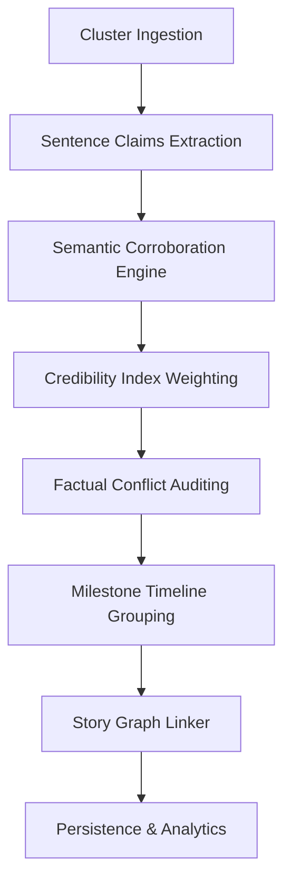
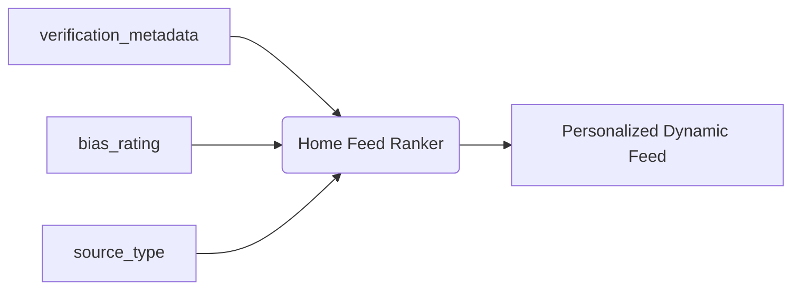

# Story Intelligence & Verification Architecture

This document describes the architectural specifications, mathematical models, and implementation details for the **Story Intelligence & Verification** layer of the AI-powered News Intelligence Platform.

---

## 1. System Overview & Verification Pipeline

The verification layer processes multi-source story clusters to evaluate semantic consensus, flag factual discrepancies, group timeline updates, and link stories in a directed semantic relationship graph.



---

## 2. Mathematical Models & Scoring

### 2.1 Claims Semantic Corroboration
For each extracted claim sentence $s_i$ in publisher $P_A$, the engine searches for a corroborating sentence $s_j$ in other publishers' articles ($P_B, P_C, \dots$).
Let $v_i, v_j$ be the 384-dimensional embeddings of $s_i$ and $s_j$. The similarity is calculated via Cosine Similarity:

$$\text{Sim}(s_i, s_j) = \frac{v_i \cdot v_j}{\|v_i\| \|v_j\|}$$

*   **Corroboration Threshold:** A claim $s_i$ is corroborated if there exists at least one $s_j$ (where $\text{Pub}(s_i) \neq \text{Pub}(s_j)$) such that $\text{Sim}(s_i, s_j) \ge 0.75$.
*   **Verification Score:** The aggregate story verification score is the ratio of verified claims to total checked claims:

$$\text{Verification Score} = \frac{\text{Verified Claims}}{\text{Total Claims Checked}}$$

### 2.2 Story Credibility Index
Credibility is computed using publisher authority weights, diversity of sources, agreement levels, and conflict rates:

$$\text{Credibility Score} = 0.3 \times \text{Diversity} + 0.4 \times \overline{\text{Credibility}}_{\text{pub}} + 0.3 \times \text{Agreement} - 0.2 \times \text{Conflict}$$

Where:
*   $\text{Diversity} = \frac{\text{Unique Publishers}}{\text{Total Articles}}$
*   $\overline{\text{Credibility}}_{\text{pub}} = \text{Average credibility\_score of member publishers}$
*   $\text{Agreement} = \text{Verification Score}$
*   $\text{Conflict} = \frac{\text{Contradicting Claims}}{\text{Total Claims Checked}}$

---

## 3. Factual & Numeric Conflict Auditing

Conflicts are detected when two claims have high semantic overlaps (Jaccard context overlap) but low embedding alignment, combined with mismatched numerical data.

### 3.1 Jaccard Context Overlap
For claims $s_i, s_j$, we extract the noun and proper-noun lemmas using spaCy. Let $N_i, N_j$ be the sets of noun terms:

$$J(N_i, N_j) = \frac{|N_i \cap N_j|}{|N_i \cup N_j|}$$

*   **Conflict Trigger:** If $J(N_i, N_j) \ge 0.40$ and $\text{Sim}(s_i, s_j) < 0.40$, a potential contradiction exists.

### 3.2 Numeric Discrepancy Checks
All numbers (excluding 4-digit years) are parsed using regex:
```regex
\b\d+(?:,\d+)*(?:\.\d+)?\b
```
If the set of numbers in claim $s_i$ differs from the set of numbers in $s_j$, the story is flagged with `has_conflicts = True`, and the conflicting claims are registered in the `evidence` field.

---

## 4. Timeline Milestone Grouping & Confidence Math

Timeline updates are organized into 6-hour chronological window groups to prevent cluttering.

```mermaid
gantt
    title Chronological Milestone Grouping (6h Windows)
    dateFormat  HH:mm
    axisFormat %H:%M
    section Window 1
    Article A (Reuters) :a1, 00:00, 10m
    Article B (AP) :a2, 02:30, 10m
    section Window 2
    Article C (BBC) :a3, 07:15, 10m
```



### Milestone Confidence Score
Each timeline milestone receives a confidence score that scales based on average quality and source diversity:

$$\text{Milestone Confidence} = \min\left(1.0, \overline{\text{Quality}}_{\text{articles}} + 0.05 \times (\text{Unique Publishers} - 1)\right)$$

This rewards multi-source corroboration within the same temporal window.

---

## 5. Story Graph Relationships Enums

Self-referencing relationships between story clusters in the database allow chronological, causal, and editorial tracking.

| Relation Type | Description |
| :--- | :--- |
| `RELATED` | Centroid similarity $\ge 0.82$, publication time gap $\le 24$ hours. |
| `FOLLOW_UP` | Centroid similarity $\ge 0.82$, publication time gap $> 24$ hours. |
| `CAUSES` | Causal dependency (e.g., policy change causing market movements). |
| `MERGED_FROM` | Set when duplicate or near-identical story clusters are consolidated. |
| `SPLIT_FROM` | Set when a story branch diverges into multiple distinct threads. |
| `CONTRADICTS` | Factual contradictions between entire story lines. |

---

## 6. Future Integration Architecture

### 6.1 Future Recommendation Engine
Structured metadata elements (like `verification_metadata` and `source_type`) will serve as features for the personalized home feed, letting users tune their feeds for credibility thresholds or source diversity.



### 6.2 Future Retrieval-Augmented Generation (RAG)
The `rag_context` and `evidence` lists provide clean JSON schemas for query parsers, allowing the conversational chatbot to fetch verified facts and trace the publisher claims that corroborate or dispute them.
