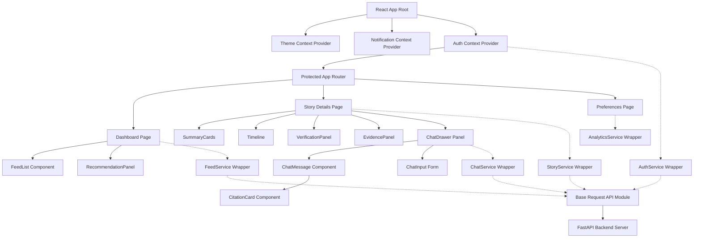
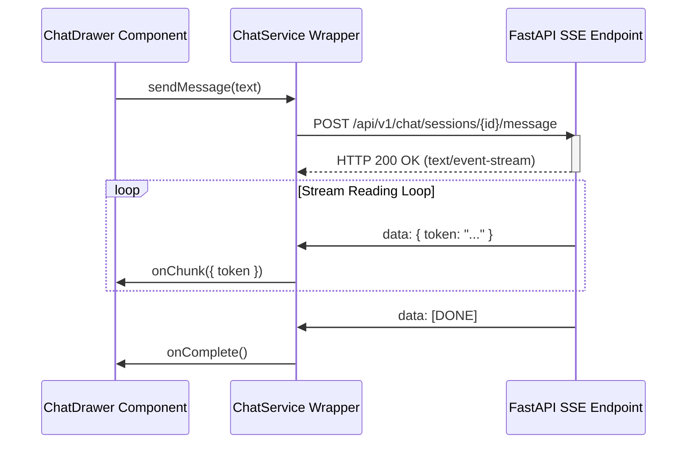

# UI System Architecture

This document describes the design pattern, components structure, and auth cycle flow of the Adaptive NewsSphere frontend app.

## System Diagram

The frontend is built on a modular model-view-controller paradigm where components never make network requests directly. Instead, they consume state from React Context Providers, which coordinate actions via API service wrappers.



## State & Context Flow

1. **Auth Context Provider (`AuthContext.jsx`):**
   - Boots up and reads `localStorage` to check if a JWT exists.
   - If a token is found, it calls `/api/v1/auth/me` to refresh user credentials (auto-login).
   - Standardizes JWT payload headers into all outbound API operations.
   - Listens to global `auth-unauthorized` events (401 triggers) to sweep storage and redirect users back to `/login`.

2. **Appearance Provider (`ThemeContext.jsx`):**
   - Governs "light", "dark", and "system" color configurations.
   - Listens to media matches (`prefers-color-scheme`) to resolve settings dynamically.
   - Mutates `document.documentElement` attributes (`data-theme="dark"` / `data-theme="light"`).

3. **Offline Telemetry (`analyticsService.js`):**
   - Keeps local logs of user interaction statistics.
   - Tracks dwell times on story view unmount events:
     ```
     Dwell Time = Component Unmount Time - Component Mount Time
     ```
   - Telemetry logs are captured offline for privacy.

## Native Fetch & SSE Streaming

All REST communication is managed through a central request utility wrapped in `fetch`. 
For RAG chat streaming, `chatService.sendMessage` bypasses standard JSON decoders and connects using a native `ReadableStream` reader:


This guarantees real-time text generation updates, maximizing responsiveness while maintaining memory limits.
